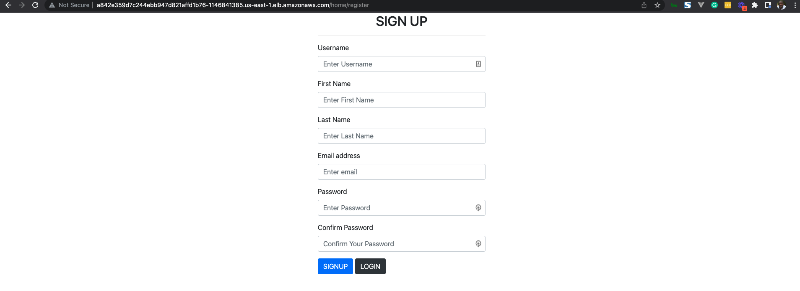
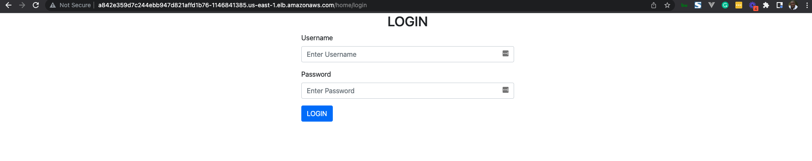
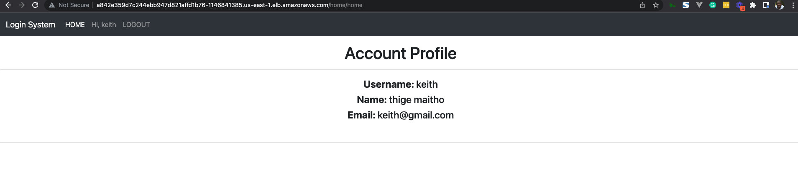
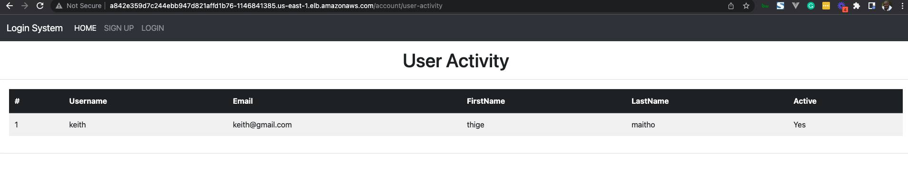

# Login App System using Django

This is a simple app to allow user to register, login and view the profile

## Running the App Locally

Starting the Application `docker compose up -d`
List runnning containers `docker compose ps`

## Deploying the Application on EKS

There is a make file with deployemnt commands to eks cluster under `/eks-deployment/` to simplify deployment locally.
For the software requirements refer to this [ReadMe file](https://github.com/maitho/live-infra#readme)

Once the [stack](https://github.com/maitho/live-infra) has been deployed use the following steps to deploy the application

- Change dir to `/eks-deployment/`
- Open the Make file and edit the `profile` for aws access
- Update kube config `Make update-kubeconfig`
- Create a namespace `Make create-namespace`
- Deploy MySQL `Make deploy-mysql-manifest`
- Deploy the login app `Make deploy-svc-lb-manifest`
- Delete MySQL `Make delete-mysql-manifest`
- Delete login app `Make delete-svc-lb-manifest`
- Get Load Balancer endpoint `Make get-lb`

## Access the Application

- Register `<load-balancer>`/home/register
- Login `<load-balancer>`/home/login
- Profile `<load-balancer>`/home/home
- User Activity `<load-balancer>`/activity/user-activity

